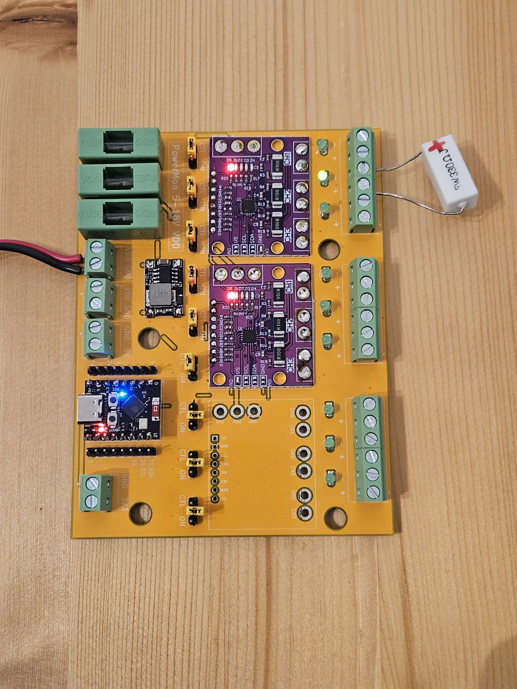
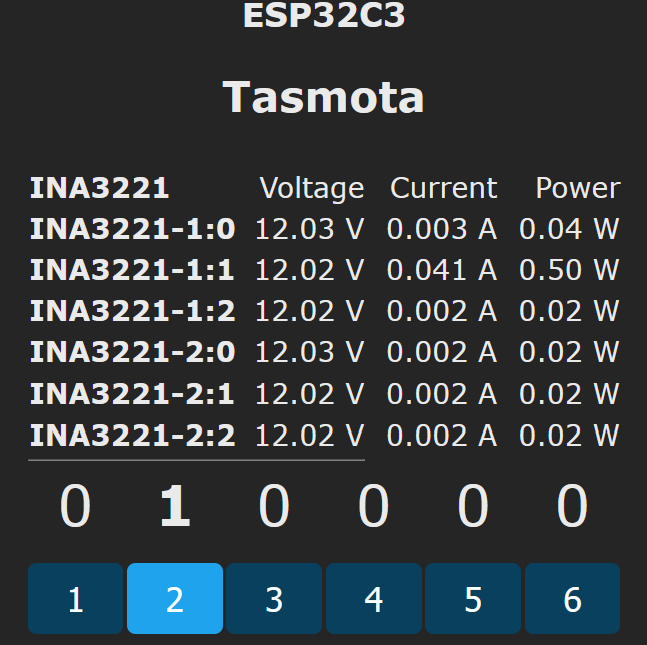
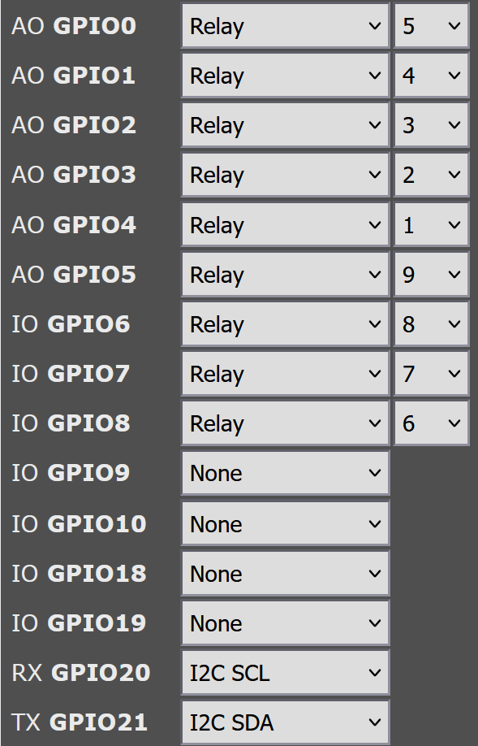

# PowerMon
A **9-channel power monitoring and control board** based on the [INA3221](https://www.ti.com/product/INA3221) current sensor and an [ESP32-C3 super mini](https://www.espboards.dev/esp32/esp32-c3-super-mini/) running (a custom compiled version of) [Tasmota](https://tasmota.github.io/).




## Features
- 9 individually controllable output channels
- Each channel can be permanently enabled/disabled using jumpers
- LEDs indicating the output state of each channel
- Power sensing for each individual channel
- -5 ~ 28V output voltage (shared between all outputs)
- 3 integrated fuse holders (5x20mm)

## Board
The board was designed using KiCad 9.
It uses custom symbols and footprints which can be found in the [footprints](footprints) directory.

Care should be taken that the right versions of the ESP32-C3 Super Mini and the INA3221 are selected (see below).
The voltage is regulated using a compact 5V volatage regulator module.

[Schematics](images/schematics_overview.png)
[Schematics for outputs](images/schematics_outputs.png)
[PCB](images/pcb.png)

The board was fabricated by [JLCPCB](https://jlcpcb.com/) and soldered by hand.

### BOM
| Qty | Part |
| --- | --- |
| 1 | **ESP32-C3 Super Mini** (there are [two versions](https://roryhay.es/blog/esp32-c3-super-mini-flaw)) |
| 3 | **INA3221 module** (the [_old version_](https://youtu.be/tCXCQwTQt9Q?si=c6mN08hn90Hn1HyM) with shared GND) |
| 1 | 5V voltage regulator [module](https://de.aliexpress.com/item/1005008257960729.html?spm=a2g0o.order_list.order_list_main.133.3af95c5fQgkEpP&gatewayAdapt=glo2deu) |
| 3 | 5x20mm fuse holder |
| 9 | SOT23 n-Channel FET like [SI2302](https://www.vishay.com/docs/68645/si2302cds.pdf) / A2SHB |
| 9 | 3mm LED with resistors |
| 9 | pin header with 3 poles + jumpers |
| 2 | pin header with 8 poles |
| 13 | 5.08mm terminal blocks with 2 poles |


## Tasmota compilation
As INA3221 support is not enabled in any of the precompiled Tasmota versions, a [custom compiled](https://github.com/tasmota/docs/blob/master/docs/Compile-your-build.md) Tasmota is used.

1. Download the latest version of [Tasmota](https://github.com/arendst/Tasmota) and open it in [PlatformIO](https://platformio.org/).
2. Enable I2C and INA3221 drivers in **tasmota/user_config_override.h** by inserting
```
#ifndef USE_I2C
#define USE_I2C
#endif

#ifndef USE_INA3221
#define USE_INA3221
#endif
```
3. In **platformio_override.ini** change _default_envs_ to `tasmota32c3` and _board_ to `esp32c3`.
4. Compile and upload.

## Tasmota configuration
To configure the freshly flashed Tasmota:

First, [connect it to your wifi](https://tasmota.github.io/docs/Getting-Started/#__tabbed_2_2).

Then, set a **static IP** using the console for a more stable connection ([see the docs](https://tasmota.github.io/docs/Commands/#wi-fi)):
```
ipaddress1 <host IP address>
ipaddress2 <gateway IP address>
ipaddress3 <subnet mask>
ipaddress4 <DNS 1 IP>
ipaddress5 1.1.1.1
```

Then **disable the feature that resets everything** if a `Button` is pressed for 5 seconds:
```
SetOption1 1
```

Then set the **pin configuration**:



Then create a [rule](https://tasmota.github.io/docs/Rules/) that [**configures the INA3221 sensors**](https://staars.github.io/docs/Commands/#sensors) after startup:
```
Rule1 ON System#Boot DO Sensor100 1, 0.1, 0.1, 0.1 ENDON ON System#Boot DO Sensor100 2, 0.1, 0.1, 0.1 ENDON ON System#Boot DO Sensor100 3, 0.1, 0.1, 0.1 ENDON
```
and enable it:
```
Rule1 1
```

Optionally, configure the number of decimals using
```
VoltRes 2
AmpRes 3
WattRes 2
```

## See also
[Here](https://github.com/arendst/Tasmota/discussions/16660) is a discussion of INA3221 configuration in Tasmota.
